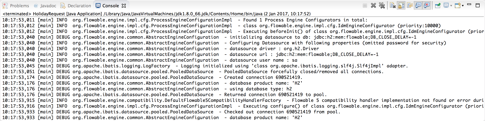

== 入门

=== Flowable 是什么?

Flowable 是一个用Java语言编写的轻量级业务流程引擎。
Flowable 流程引擎允许您部署BPMN 2.0流程定义文件（用于定义流程的行业XML标准文件），
创建这些流程定义的流程实例，执行查询，访问活动或历史流程实例、相关数据，以及更多。
本节将逐步介绍各种概念和API，您可以在自己的开发机器上运行一些例子来熟悉 Flowable。

Flowable 可以非常灵活的添加到您的应用程序/服务/架构中。
_引入_ Flowable库(JAR)之后，您就可以在您的应用程序或服务中使用了。
因为它是仅仅是一个JAR，您可以很容易地将它添加到任何Java环境：Java SE；servlet 容器，如Tomcat或Jetty，Spring；JavaEE服务器，如JBase/WebSphere等。
或者，你也可以直接使用 Flowable REST API 通过HTTP进行通信。
还有几个Flowable应用程序（Flowable 建模器、Flowable 管理员、Flowable 身份管理 和 Flowable 任务管理）提供开箱即用的用于处理流程和任务的UI示例。

设置 Flowable 所有方法的共同之处是核心引擎，它可以看作是一个服务集合，暴露API来管理和执行业务流程。
下面的教程会首先介绍如何设置和使用这个核心引擎，之后的章节对是建立在前面章节中获得知识的基础上。

* <<getting.started.command.line, 第一节>> 演示如何以最简单的方式运行 Flowable：一个只使用Java SE的常规Java主程序。这里将解释许多核心概念和API。
* <<getting.started.command.line, Flowable REST API>> 的部分展示了如何通过REST运行和使用相同的API。
* <<getting.started.flowable.app, Flowable App>> 将指导您使用开箱即用的 Flowable 用户界面的基本知识。

=== Flowable 和 Activiti

Flowable是Activiti（Alfresco注册的商标）的一个分支。
在下面的所有部分中，您可能会注意到包名称、配置文件等都使用了 _flowable_ 。

[[getting.started.command.line]]
=== 构建命令行应用程序

==== 创建流程引擎

在第一个教程中，我们将构建一个简单的示例，演示如何创建一个 Flowable 流程引擎，介绍一些核心概念，以及如何使用API。
虽然屏幕截图展示的是 Eclipse，但任何IDE都可以工作。
我们将使用Maven获取 Flowable 的依赖项并管理构建，但是同样地，任何其他方法也可以工作（Gradle, Ivy等）。

这个例子我们将构建的是一个简单的 _假期申请_ 流程：

* _员工_ 请求几天的假期
* _经理_ 批准或拒绝这个请求
* 我们将模拟在一些外部系统中注册请求，并将结果以E-mail的形式发送给员工。

首先，我们通过 _File -> New -> Other -> Maven Project_ 的方式创建一个Maven项目

image::images/getting.started.new.maven.png[align="center"]

在下一张截图中，我们选择 '_create a simple project (跳过maven结构脚手架部分)_'

image::images/getting.started.new.maven2.png[align="center"]

然后填写 _'Group Id'_ 和 _'Artifact id'_:

image::images/getting.started.new.maven3.png[align="center"]

现在我们就有了一个空的Maven项目，添加两个依赖:

* Flowable 流程引擎, 它可以让我们创建流程引擎对象和调用 Flowable APIs.
* H2，一个内存型数据库，本例中 Flowable 引擎需要一个数据库来存储执行流程实例时的执行记录和历史数据。
请注意H2依赖已经依赖包括了数据库 _和_ 驱动。如果你使用的是其它的数据库(例如PostgresQL, MySQL等)，你可能需要额外添加一个驱动依赖。

将以下内容添加到您的 _pom.xml_ 文件中:

[source,xml,linenums]
----
<dependencies>
  <dependency>
    <groupId>org.flowable</groupId>
    <artifactId>flowable-engine</artifactId>
    <version>6.4.1</version>
  </dependency>
  <dependency>
    <groupId>com.h2database</groupId>
    <artifactId>h2</artifactId>
    <version>1.3.176</version>
  </dependency>
</dependencies>
----

某些原因无法自动检测JAR时，可以右键点击项目，选择 '_Maven -> Update Project_' 来强制手动刷新(但通常不需要这么做)。
这样在项目中的 '_Maven Dependencies_' 下就可以看到 _flowable-engine_ 的各种其它(可传递)依赖了。

创建一个JAVA类并添加一个标准的main方法:

[source,java,linenums]
----
package org.flowable;

public class HolidayRequest {

  public static void main(String[] args) {

  }

}
----

首先我们要做的是实例化一个 *ProcessEngine* 实例。
这是一个线程安全的对象，通常在你的应用中只需要实例化一次(单例)。
从 *ProcessEngineConfiguration* 实例中创建一个实例 _ProcessEngine_ ，它可以配置或调整流程引擎的配置。
通常 _ProcessEngineConfiguration_ 是使用XML配置文件创建的，但是(就像我们这里使用的)你也可以通过编程方式进行创建。
_ProcessEngineConfiguration_ 的配置最少需要一个连接数据库的配置:

[source,java,linenums]
----
package org.flowable;

import org.flowable.engine.ProcessEngine;
import org.flowable.engine.ProcessEngineConfiguration;
import org.flowable.engine.impl.cfg.StandaloneProcessEngineConfiguration;

public class HolidayRequest {

  public static void main(String[] args) {
    ProcessEngineConfiguration cfg = new StandaloneProcessEngineConfiguration()
      .setJdbcUrl("jdbc:h2:mem:flowable;DB_CLOSE_DELAY=-1")
      .setJdbcUsername("sa")
      .setJdbcPassword("")
      .setJdbcDriver("org.h2.Driver")
      .setDatabaseSchemaUpdate(ProcessEngineConfiguration.DB_SCHEMA_UPDATE_TRUE);

    ProcessEngine processEngine = cfg.buildProcessEngine();
  }

}
----

在上面的代码中，第10行创建了一个 _独立_ 的配置对象。
这里的 _'独立'_ 是指引擎完全由自己创建和使用（而不是在Spring环境中，使用 _SpringProcessEngineConfiguration_ 这样的配置类进行创建）。
在第11到14行中，将JDBC连接参数传递给内存中的H2数据库实例。

IMPORTANT: 请注意，这样的数据库在JVM重启时不会存活(不会保留数据)。

如果想持久化数据，则需要切换到持久化数据库，并相应的切换连接参数。
在15行，我们设置了一个参数为 _true_ ，这样是为了确保在JDBC参数中指定的数据库结构不存在时创建数据库。
另外，Flowable 也提供了一组SQL文件，其中包含所有的表结构，这样我们就可以手动创建数据库了。

然后使用这个配置创建 *ProcessEngine* 对象(17行)。

现在可以启动它了。
最简单的方式是在 Eclipse 中右键这个类然后选择 _Run As -> Java Application_:

image::images/getting.started.run.main.png[align="center"]

应用会正常启动，但是，控制台中也没有显示什么有用的信息，仅有一条状态类消息，这是因为还没有配置日志:

image::images/getting.started.console.logging.png[align="center"]

Flowable 使用 link:$$http://www.slf4j.org/$$[SLF4J] 作为内部日志框架。
在这个例子中，我们会使用 log4j 作为 SLF4j 的实现，所以把下面的依赖加入到 pom.xml 文件中:

[source,xml,linenums]
----
<dependency>
  <groupId>org.slf4j</groupId>
  <artifactId>slf4j-api</artifactId>
  <version>1.7.21</version>
</dependency>
<dependency>
  <groupId>org.slf4j</groupId>
  <artifactId>slf4j-log4j12</artifactId>
  <version>1.7.21</version>
</dependency>
----

Log4j 需要一个配置文件来进行配置。
将一个带有以下内容的 _log4j.properties_ 文件添加到 _src/main/resources_ 目录中:

----
log4j.rootLogger=DEBUG, CA

log4j.appender.CA=org.apache.log4j.ConsoleAppender
log4j.appender.CA.layout=org.apache.log4j.PatternLayout
log4j.appender.CA.layout.ConversionPattern= %d{hh:mm:ss,SSS} [%t] %-5p %c %x - %m%n
----

重新运行应用程序。现在，您就可以看到有关启动引擎和创建数据库结构的日志信息了：

现在我们已经启动了一个流程引擎并准备就绪。是时候给它提供一个流程了！

==== 部署流程定义

The process we'll build is a very simple holiday request process. The Flowable engine expects processes to be defined in the BPMN 2.0 format, which is an XML standard that is widely accepted in the industry. 
In Flowable terminology, we speak about this as a *process definition*. From a _process definition_, many *process instances* can be started. Think of the _process definition_ as the blueprint for many executions 
of the process. In this particular case, the _process definition_ defines the different steps involved in requesting holidays, while one _process instance_ matches the request for a holiday by one particular employee.

BPMN 2.0 is stored as XML, but it has a visualization part too: it defines in a standard way how each different step type (a human task, an automatic service call, and so on) is represented and how to connect 
these different steps to each other. Through this, the BPMN 2.0 standard allows technical and business people to communicate about business processes in a way that both parties understand.

The process definition we'll use is the following:

image::images/getting.started.bpmn.process.png[align="center"]

The process should be quite self-explanatory, but for clarity's sake let's describe the different bits:

* We assume the process is started by providing some information, such as the employee name, the amount of holiday requested and a description. Of course, this could be modeled as a separate first step in the process. 
However, by having it as 'input data' for the process, a process instance is only actually created when a real request has been made. In the alternative case, a user could change his mind and cancel before submitting, yet the process instance would now be there. 
In some scenarios this could be valuable information (for example, how many times is a request started, but not finished), depending on the business goal.
* The circle on the left is called a *start event*. It's the starting point of a process instance.
* The first rectangle is a *user task*. This is a step in the process that a human user has to perform. In this case, the manager needs to approve or reject the request.
* Depending on what the manager decides, the *exclusive gateway* (the diamond shape with the cross) will route the process instance to either the approval or the rejection path.
* If approved, we have to register the request in some external system, which is followed by a user task again for the original employee that notifies them of the decision. 
This could, of course, be replaced by an email.
* If rejected, an email is sent to the employee informing them of this.

Typically, such a _process definition_ is modeled with a visual modeling tool, such as the Flowable Designer (Eclipse) or the Flowable Modeler (web application).

Here, however, we're going to write the XML directly to familiarize ourselves with BPMN 2.0 and its concepts.

The BPMN 2.0 XML corresponding to the diagram above is shown below. Note that this is only the 'process part'. If you'd used a graphical modeling tool, the underlying XML file also contains the 'visualization' part that describes the graphical information, such as the coordinates of the various elements of the process definition (all graphical information is contained in the _BPMNDiagram_ tag in the XML, which is a child element of the _definitions_ tag).

Save the following XML in a file named _holiday-request.bpmn20.xml_ in the _src/main/resources_ folder.

[source,xml,linenums]
----
<?xml version="1.0" encoding="UTF-8"?>
<definitions xmlns="http://www.omg.org/spec/BPMN/20100524/MODEL"
  xmlns:xsi="http://www.w3.org/2001/XMLSchema-instance"
  xmlns:xsd="http://www.w3.org/2001/XMLSchema"
  xmlns:bpmndi="http://www.omg.org/spec/BPMN/20100524/DI"
  xmlns:omgdc="http://www.omg.org/spec/DD/20100524/DC"
  xmlns:omgdi="http://www.omg.org/spec/DD/20100524/DI"
  xmlns:flowable="http://flowable.org/bpmn"
  typeLanguage="http://www.w3.org/2001/XMLSchema"
  expressionLanguage="http://www.w3.org/1999/XPath"
  targetNamespace="http://www.flowable.org/processdef">

  <process id="holidayRequest" name="Holiday Request" isExecutable="true">

    <startEvent id="startEvent"/>
    <sequenceFlow sourceRef="startEvent" targetRef="approveTask"/>

    <userTask id="approveTask" name="Approve or reject request"/>
    <sequenceFlow sourceRef="approveTask" targetRef="decision"/>

    <exclusiveGateway id="decision"/>
    <sequenceFlow sourceRef="decision" targetRef="externalSystemCall">
      <conditionExpression xsi:type="tFormalExpression">
        <![CDATA[
          ${approved}
        ]]>
      </conditionExpression>
    </sequenceFlow>
    <sequenceFlow  sourceRef="decision" targetRef="sendRejectionMail">
      <conditionExpression xsi:type="tFormalExpression">
        <![CDATA[
          ${!approved}
        ]]>
      </conditionExpression>
    </sequenceFlow>

    <serviceTask id="externalSystemCall" name="Enter holidays in external system" 
        flowable:class="org.flowable.CallExternalSystemDelegate"/>
    <sequenceFlow sourceRef="externalSystemCall" targetRef="holidayApprovedTask"/>

    <userTask id="holidayApprovedTask" name="Holiday approved"/>
    <sequenceFlow sourceRef="holidayApprovedTask" targetRef="approveEnd"/>

    <serviceTask id="sendRejectionMail" name="Send out rejection email" 
        flowable:class="org.flowable.SendRejectionMail"/>
    <sequenceFlow sourceRef="sendRejectionMail" targetRef="rejectEnd"/>

    <endEvent id="approveEnd"/>

    <endEvent id="rejectEnd"/>

  </process>

</definitions>
----

Lines 2 to 11 look a bit daunting, but it's the same as you'll see in almost every process definition. It's kind of _boilerplate_ stuff that's needed to be fully compatible with the BPMN 2.0 standard specification.

Every step (in BPMN 2.0 terminology, *'activity'*) has an _id_ attribute that gives it a unique identifier in the XML file. All _activities_ can have an optional name too, which increases the readability of the visual diagram, of course.

The _activities_ are connected by a *sequence flow*, which is a directed arrow in the visual diagram. When executing a process instance, the execution will flow from the _start event_ to the next _activity_, following the _sequence flow_.

The _sequence flows_ leaving the _exclusive gateway_ (the diamond shape with the X) are clearly special: both have a _condition_ defined in the form of an _expression_ (see line 25 and 32). When the process instance execution reaches this _gateway_, the _conditions_ are evaluated and the first that resolves to _true_ is taken. This is what the _exclusive_ stands for here: only one is selected. Other types of gateways are, of course, possible if different routing behavior is needed.

The condition written here as an _expression_ is of the form _${approved}_, which is a shorthand for _${approved == true}_. The variable 'approved' is called a *process variable*. A _process variable_ is a persistent bit of data that is stored together with the process instance and can be used during the lifetime of the process instance. In this case, it does mean that we will have to set this _process variable_ at a certain point (when the manager user task is submitted or, in Flowable terminology, _completed_) in the process instance, as it's not data that is available when the process instance starts.

Now we have the process BPMN 2.0 XML file, we next need to *'deploy'* it to the engine. _Deploying_ a process definition means that:

* the process engine will store the XML file in the database, so it can be retrieved whenever needed
* the process definition is parsed to an internal, executable object model, so that _process instances_ can be started from it.

To _deploy_ a process definition to the Flowable engine, the _RepositoryService_ is used, which can be retrieved from the _ProcessEngine_ object. Using the _RepositoryService_, a new _Deployment_ is created by passing the location of the XML file and calling the _deploy()_ method to actually execute it:

[source,java,linenums]
----
RepositoryService repositoryService = processEngine.getRepositoryService();
Deployment deployment = repositoryService.createDeployment()
  .addClasspathResource("holiday-request.bpmn20.xml")
  .deploy();
----

We can now verify that the process definition is known to the engine (and learn a bit about the API) by querying it through the API. This is done by creating a new _ProcessDefinitionQuery_ object through the _RepositoryService_.

[source,java,linenums]
----
ProcessDefinition processDefinition = repositoryService.createProcessDefinitionQuery()
  .deploymentId(deployment.getId())
  .singleResult();
System.out.println("Found process definition : " + processDefinition.getName());
----

==== Starting a process instance

We now have the process definition _deployed_ to the process engine, so _process instances_ can be started using this _process definition_ as a 'blueprint'.

To start the process instance, we need to provide some initial _process variables_. Typically, you'll get these through a form that is presented to the user or through a REST API when a process is triggered by something automatic. In this example, we'll keep it simple and use the java.util.Scanner class to simply input some data on the command line:

[source,java,linenums]
----
Scanner scanner= new Scanner(System.in);

System.out.println("Who are you?");
String employee = scanner.nextLine();

System.out.println("How many holidays do you want to request?");
Integer nrOfHolidays = Integer.valueOf(scanner.nextLine());

System.out.println("Why do you need them?");
String description = scanner.nextLine();
----

Next, we can start a _process instance_ through the _RuntimeService_. The collected data is passed as a _java.util.Map_ instance, where the key is the identifier that will be used to retrieve the variables later on. The process instance is started using a _key_. This _key_ matches the _id_ attribute that is set in the BPMN 2.0 XML file, in this case _holidayRequest_.

(NOTE: there are many ways you'll learn later on to start a process instance, beyond using a key)

[source,xml]
----
<process id="holidayRequest" name="Holiday Request" isExecutable="true">
----

[source,java,linenums]
----
RuntimeService runtimeService = processEngine.getRuntimeService();

Map<String, Object> variables = new HashMap<String, Object>();
variables.put("employee", employee);
variables.put("nrOfHolidays", nrOfHolidays);
variables.put("description", description);
ProcessInstance processInstance =
  runtimeService.startProcessInstanceByKey("holidayRequest", variables);
----

When the process instance is started, an *execution* is created and put in the start event. From there, this _execution_ follows the sequence flow to the user task for the manager approval and executes the user task behavior. This behavior will create a task in the database that can be found using queries later on. A user task is a _wait state_ and the engine will stop executing anything further, returning the API call.

==== Sidetrack: transactionality

In Flowable, database transactions play a crucial role to guarantee data consistency and solve concurrency problems. When you make a Flowable API call, by default, everything is synchronous and part of the same transaction. Meaning, when the method call returns, a transaction will be started and committed.

When a process instance is started, there will be *one database transaction* from the start of the process instance to the next _wait state_. In this example, this is the first user task. When the engine reaches this user task, the state is persisted to the database and the transaction is committed and the API call returns.

In Flowable, when continuing a process instance, there will always be one database transaction going from the previous _wait state_ to the next _wait state_. Once persisted, the data can be in the database for a long time, even years if it has to be, until an API call is executed that takes the process instance further. Note that no computing or memory resources are consumed when the process instance is in such a wait state, waiting for the next API call.

In the example here, when the first user task is completed, one database transaction will be used to go from the user task through the exclusive gateway (the automatic logic) until the second user task. Or straight to the end with the other path.

==== Querying and completing tasks

In a more realistic application, there will be a user interface where the employees and the managers can log in and see their task lists. With these, they can inspect the process instance data that is stored as _process variables_ and decide what they want to do with the task. In this example, we will mimic task lists by executing the API calls that normally would be behind a service call that drives a UI.

We haven't yet configured the assignment for the user tasks. We want the first task to go the 'managers' group and the second user task to be assigned to the original requester of the holiday. To do this, add the _candidateGroups_ attribute to the first task:

[source,xml]
----
<userTask id="approveTask" name="Approve or reject request" flowable:candidateGroups="managers"/>
----

and the _assignee_ attribute to the second task as shown below. Note that we're not using a static value like the 'managers' value above, but a dynamic assignment based on a process variable that we've passed when the process instance was started:

[source,xml]
----
<userTask id="holidayApprovedTask" name="Holiday approved" flowable:assignee="${employee}"/>
----

To get the actual task list, we create a _TaskQuery_ through the _TaskService_ and we configure the query to only return the tasks for the 'managers' group:

[source,java,linenums]
----
TaskService taskService = processEngine.getTaskService();
List<Task> tasks = taskService.createTaskQuery().taskCandidateGroup("managers").list();
System.out.println("You have " + tasks.size() + " tasks:");
for (int i=0; i<tasks.size(); i++) {
  System.out.println((i+1) + ") " + tasks.get(i).getName());
}
----

Using the task identifier, we can now get the specific process instance variables and show on the screen the actual request:

[source,java,linenums]
----
System.out.println("Which task would you like to complete?");
int taskIndex = Integer.valueOf(scanner.nextLine());
Task task = tasks.get(taskIndex - 1);
Map<String, Object> processVariables = taskService.getVariables(task.getId());
System.out.println(processVariables.get("employee") + " wants " + 
    processVariables.get("nrOfHolidays") + " of holidays. Do you approve this?");
----

Which, if you run this, should look something like this:

image::images/getting.started.console.logging3.png[align="center"]

The manager can now *complete the task*. In reality, this often means that a form is submitted by the user. The data from the form is then passed as _process
 variables_. Here, we'll mimic this by passing a map with the 'approved' variable (the name is important, as it's used later on in the conditions of the sequence flow!) when the task is completed:

[source,java,linenums]
----
boolean approved = scanner.nextLine().toLowerCase().equals("y");
variables = new HashMap<String, Object>();
variables.put("approved", approved);
taskService.complete(task.getId(), variables);
----

The task is now completed and one of the two paths leaving the exclusive gateway is selected based on the 'approved' process variable.

[[getting.started.delegate]]
==== Writing a JavaDelegate

There is a last piece of the puzzle still missing: we haven't implemented the automatic logic that will get executed when the request is approved. In the BPMN 2.0 XML this is a *service task* and it looked above like:

[source,xml]
----
<serviceTask id="externalSystemCall" name="Enter holidays in external system" 
    flowable:class="org.flowable.CallExternalSystemDelegate"/>
----

In reality, this logic could be anything, ranging from calling a service with HTTP REST, to executing some legacy code calls to a system the organization has
been using for decades. We won't implement the actual logic here but simply log the _processing_.

Create a new class (_File -> New -> Class_ in Eclipse), fill in _org.flowable_ as package name and _CallExternalSystemDelegate_ as class name. Make that class implement the _org.flowable.engine.delegate.JavaDelegate_ interface and implement the _execute_ method:

[source,java,linenums]
----
package org.flowable;

import org.flowable.engine.delegate.DelegateExecution;
import org.flowable.engine.delegate.JavaDelegate;

public class CallExternalSystemDelegate implements JavaDelegate {

    public void execute(DelegateExecution execution) {
        System.out.println("Calling the external system for employee "
            + execution.getVariable("employee"));
    }

}
----

When the _execution_ arrives at the _service task_, the class that is referenced in the BPMN 2.0 XML is instantiated and called.

When running the example now, the logging message is shown, demonstrating the custom logic is indeed executed:

image::images/getting.started.console.logging4.png[align="center"]

==== Working with historical data

One of the many reasons for choosing to use a process engine like Flowable is because it automatically stores *audit data* or *historical data* for all the process instances. This data allows the creation of rich reports that give insights into how the organization works, where the bottlenecks are, etc.

For example, suppose we want to show the duration of the process instance that we've been executing so far. To do this, we get the _HistoryService_  from the _ProcessEngine_ and create a query for _historical activities_. In the snippet below you can see we add some additional filtering:

* only the activities for one particular process instance
* only the activities that have finished

The results are also sorted by end time, meaning that we'll get them in execution order.

[source,java,linenums]
----
HistoryService historyService = processEngine.getHistoryService();
List<HistoricActivityInstance> activities =
  historyService.createHistoricActivityInstanceQuery()
   .processInstanceId(processInstance.getId())
   .finished()
   .orderByHistoricActivityInstanceEndTime().asc()
   .list();

for (HistoricActivityInstance activity : activities) {
  System.out.println(activity.getActivityId() + " took "
    + activity.getDurationInMillis() + " milliseconds");
}
----

Running the example again, we now see something like this in the console:

----
startEvent took 1 milliseconds
approveTask took 2638 milliseconds
decision took 3 milliseconds
externalSystemCall took 1 milliseconds
----

==== Conclusion

This tutorial introduced various Flowable and BPMN 2.0 concepts and terminology, while also demonstrating how to use the Flowable API programmatically.

Of course, this is just the start of the journey. The following sections will dive more deeply into the many options and features that the Flowable engine supports. Other sections go into the various ways the Flowable engine can be set up and used, and describe in detail all the BPMN 2.0 constructs that are possible.

[[getting.started.rest]]
=== Getting started with the Flowable REST API

This section shows the same example as the <<getting.started.command.line, previous section>>: deploying a process definition, starting a process instance, getting a task list and completing a task. If you haven't read that section, it might be good to skim through it to get an idea of what is done there.

This time, the Flowable REST API is used rather than the Java API. You'll soon notice that the REST API closely matches the Java API, and knowing one automatically means that you can find your way around the other.

To get a full, detailed overview of the Flowable REST API, check out the <<restApiChapter, REST API chapter>>.

==== Setting up the REST application

When you download the .zip file from the flowable.org website, the REST application can be found in the _wars_ folder. You'll need a servlet container, such as link:$$http://tomcat.apache.org//$$[Tomcat], link:$$http://www.eclipse.org/jetty//$$[Jetty], and so on, to run the WAR file.

When using Tomcat the steps are as follows:

* Download and unzip the latest and greatest Tomcat zip file (choose the 'Core' distribution from the Tomcat website).
* Copy the flowable-rest.war file from the _wars_ folder of the unzipped Flowable distribution to the _webapps_ folder of the unzipped Tomcat folder.
* On the command line, go to the _bin_ folder of the Tomcat folder.
* Execute '_./catalina run_' to boot up the Tomcat server.

During the server boot up, you'll notice some Flowable logging messages passing by. At the end, a message like '_INFO [main] org.apache.catalina.startup.Catalina.start Server startup in xyz ms_' indicates that the server is ready to receive requests. Note that by default an in-memory H2 database instance is used, which means that data won't survive a server restart.

In the following sections, we'll use cURL to demonstrate the various REST calls. All REST calls are by default protected with _basic authentication_. The user 'rest-admin' with password 'test' is used in all calls.

After bootup, verify the application is running correctly by executing

----
curl --user rest-admin:test http://localhost:8080/flowable-rest/service/management/engine
----

If you get back a proper json response, the REST API is up and running.

==== Deploying a process definition

The first step is to deploy a process definition. With the REST API, this is done by uploading a .bpmn20.xml file (or .zip file for multiple process definitions) as 'multipart/formdata':

----
curl --user rest-admin:test -F "file=@holiday-request.bpmn20.xml" http://localhost:8080/flowable-rest/service/repository/deployments
----

To verify that the process definition is deployed correctly, the list of process definitions can be requested:

----
curl --user rest-admin:test http://localhost:8080/flowable-rest/service/repository/process-definitions
----

which returns a list of all process definitions currently deployed to the engine.

==== Start a process instance

Starting a process instance through the REST API is similar to doing the same through the Java API: a _key_ is provided to identify the process definition to use along with a map of initial process variables:

----
curl --user rest-admin:test -H "Content-Type: application/json" -X POST -d '{ "processDefinitionKey":"holidayRequest", "variables": [ { "name":"employee", "value": "John Doe" }, { "name":"nrOfHolidays", "value": 7 }]}' http://localhost:8080/flowable-rest/service/runtime/process-instances
----

which returns something like

----
{"id":"43","url":"http://localhost:8080/flowable-rest/service/runtime/process-instances/43","businessKey":null,"suspended":false,"ended":false,"processDefinitionId":"holidayRequest:1:42","processDefinitionUrl":"http://localhost:8080/flowable-rest/service/repository/process-definitions/holidayRequest:1:42","activityId":null,"variables":[],"tenantId":"","completed":false}
----

==== Task list and completing a task

When the process instance is started, the first task is assigned to the 'managers' group. To get all tasks for this group, a task query can be done through the REST API:

----
curl --user rest-admin:test -H "Content-Type: application/json" -X POST -d '{ "candidateGroup" : "managers" }' http://localhost:8080/flowable-rest/service/query/tasks
----

which returns a list of all tasks for the 'managers' group

Such a task can now be completed using:

----
curl --user rest-admin:test -H "Content-Type: application/json" -X POST -d '{ "action" : "complete", "variables" : [ { "name" : "approved", "value" : true} ]  }' http://localhost:8080/flowable-rest/service/runtime/tasks/25
----

However, you most likely will get an error like:

----
{"message":"Internal server error","exception":"couldn't instantiate class org.flowable.CallExternalSystemDelegate"}
----

This means that the engine couldn't find the _CallExternalSystemDelegate_ class that is referenced in the service task. To solve this, the class needs to be put on the classpath of the application (which will require a restart). Create the class as described in <<getting.started.delegate, this section>>, package it up as a JAR and put it in the _WEB-INF/lib_ folder of the flowable-rest folder under the _webapps_ folder of Tomcat.
